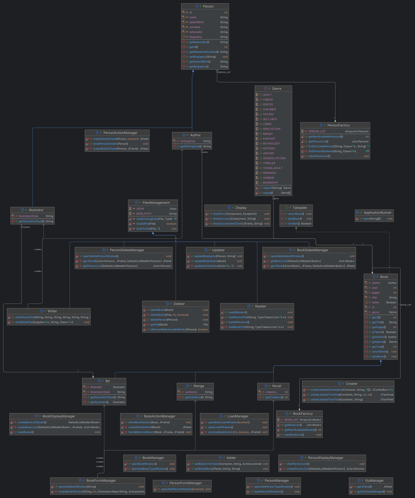

# Library Management System

## 📚 Project Overview

### Introduction

This comprehensive Library Management System is developed in Java with a Swing GUI interface. It allows librarians to efficiently manage books, authors, and illustrators. The application provides an intuitive interface for adding different types of books (Novels, Manga, Comic Books), viewing existing collections, and managing loans. All data persists through JSON files.

### Project Goals

The primary objectives of this system are to:
- Maintain a comprehensive catalog of different book types
- Manage a database of authors and illustrators
- Track book borrowings and returns
- Ensure data persistence via JSON files

## ✨ Core Features

- **Book Management**:
    - Add and delete different book types (Novels, Manga, Comic Books)
    - Browse the complete collection with detailed information
    - View availability status of each book

- **Person Management**:
    - Add and manage authors with their writing styles
    - Add and manage illustrators with their illustration styles

- **Loan Management**:
    - Borrow available books
    - Return borrowed books
    - Track loan status

## 🛠️ Getting Started

### Prerequisites

- Java Development Kit (JDK) 21 or higher
- IntelliJ IDEA or any Java IDE
- Gson library for JSON manipulation

### Setup Instructions

1. Clone the repository
    ```ssh
    git clone https://github.com/Torolgo/ynov-java-libraryManagement.git
    ```
2. Open the project in your IDE
3. Make sure that the Gson library is correctly configured in the project classpath.
      It is supposed to be contained in the lib package. If this is not the case, you can add it manually:
    - [Download Gson from the official website](https://mvnrepository.com/artifact/com.google.code.gson/gson)
    - Take version 2.12.1
    - Add the jar file to your project:
        - In IntelliJ IDEA, go to File > Project Structure > Libraries
        - Click on the "+" icon and select "Java" to add the Gson jar file
4. Run the `ApplicationRunner` class to start the application

## 💻 Technical Architecture

### Package Organization

The project follows a structured organization with distinct packages:

- **domain**: Contains domain model classes that represent the core entities
- **factory**: Handles data persistence through JSON files
- **gui**: Manages the user interface components
- **main**: Contains the application entry point

### Data Persistence

All data is stored in JSON files located in the assets directory:
- `authors.json`: Author information
- `illustrators.json`: Illustrator information
- `novels.json`: Novel book entries
- `bd.json`: Comic book entries
- `manga.json`: Manga book entries

### User Interface

The GUI is built using Java Swing and organized into three main sections:
1. **Book Management**: Adding and viewing various book types
2. **Person Management**: Adding and viewing authors and illustrators
3. **Loan Management**: Borrowing and returning books

### Class diagram
The class diagram illustrates the relationships between the main classes in the project. It includes the following key classes:
<p align="center">
  
</p>

## ▶️ Use

### Main interface: The main window offers three options:
Manage Authors/Illustrators
Manage Books
Manage Borrowings

### Manage Authors and Illustrators :
Add: Create new authors or illustrators with their detailed information
View: See the complete list and access each person's details
Delete: Remove authors/illustrators from the database

### Book management :
Add: Create new books (Novels, Mangas or Comics)
View: View complete list of books with status
Delete: Remove books from the library

#### Borrowing management :
Borrow a book: Mark a book as borrowed
Return a book: Mark a borrowed book as available

## 👥 Contributors

This project was developed by:
<br>
<a href="https://github.com/Torolgo"></a>